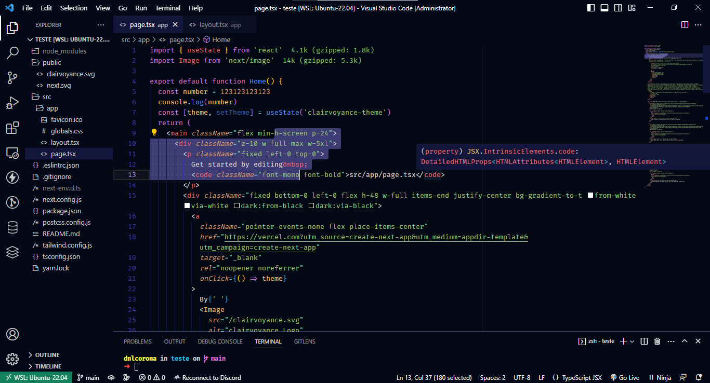
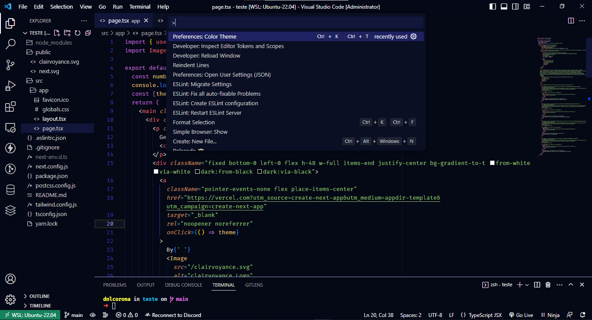

# Clairvoyance Theme 🔮

<h2 align="center">VSCode Dark Theme</h2>
<div align="center">
  <a href="https://github.com/dnlcorona" target="_blank">
    
  </a>

  <a href="https://marketplace.visualstudio.com/items?itemName=dnlcorona.clairvoyance-theme" target="_blank">
    
  </a>
</div>

## 📁 Projeto

Um tema do Visual Studio Code simples e moderno. Ajustado para melhorar a experiência de programação em ambientes de pouca luz ou para aqueles que preferem um tema de cores mais escuro. As escolhas de cores foram feitas baseadas em um contraste significativo para a compreensão da leitura e para um efeito visual ideal. ✨

## 🔥 Preview






# Instalação

1.  Instale o [Visual Studio Code](https://code.visualstudio.com/)
2.  Abra o Visual Studio Code
3.  Clique em **Extensions** no menu lateral esquerdo
4.  Pesquise por `Clairvoyance Theme` e selecione este tema na lista de resultados
5.  Clique em **Install** para instalar o tema
6.  Clique em **Reload** para aplicar o tema
7.  Na barra de menus, clique: Code > Preferences > Color Theme > **Clairvoyance Theme**


## Preferências mostradas no preview

A fonte utilizada na imagem de preview é a Fira Code, [disponível aqui](https://github.com/tonsky/FiraCode). Segue as configurações no setting.json para ativar font ligatures:

```
"editor.fontFamily": "Fira Code",
"editor.fontLigatures": true,
```

Extensão de ícones utilizada no preview: [Chalice Icon Theme](https://marketplace.visualstudio.com/items?itemName=artlaman.chalice-icon-theme), extensão de ícones minimalista.


## 🚀 **Em constante evolução...**

---

Feito com ♥ by [Daniel Corona](https://www.linkedin.com/in/dnlcorona/)
