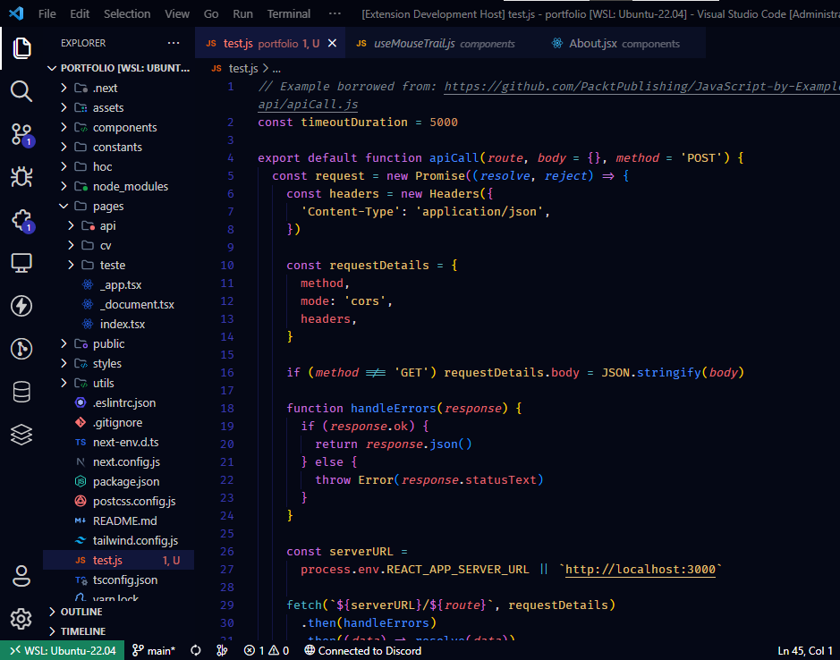
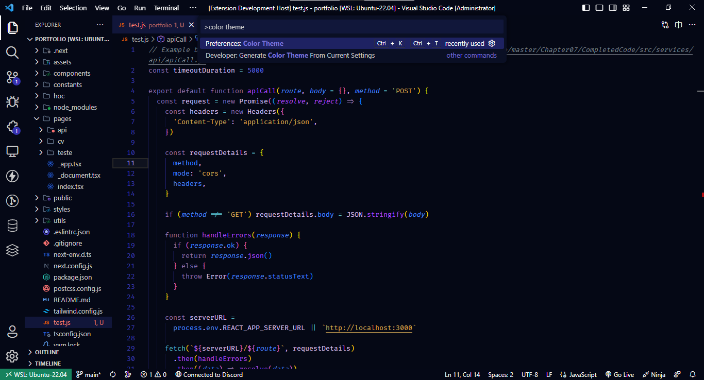
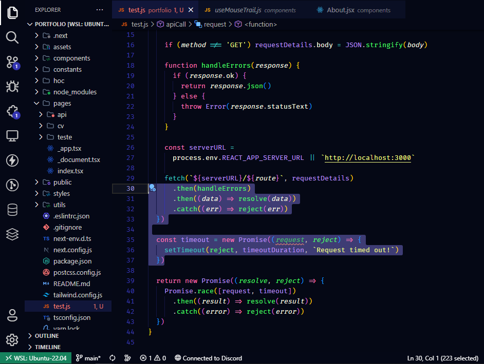
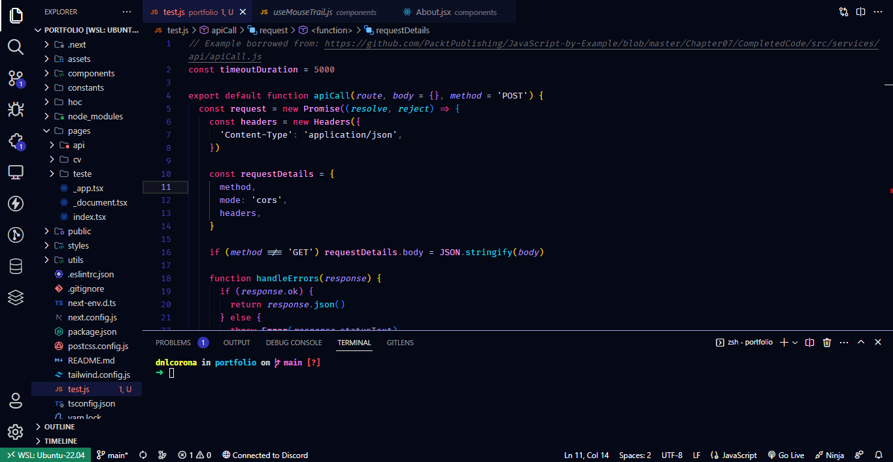

<h1>
  <br>
  Clairvoyance Theme 🔮
  <br>
</h1>

<p align="center">
  <strong>VSCode Dark Theme</strong>
</p>

<div align="center">
  <a href="https://github.com/dnlcorona" target="_blank">
    
  </a>

  <a href="#Installation" target="_blank">
    
  </a>

  <a href="https://marketplace.visualstudio.com/items?itemName=dnlcorona.clairvoyance-theme" target="_blank">
    
  </a>
</div>
<br>
<br>
<p align="center">
  <a href="#Installation">Install</a> •
  <a href="#license">License</a>
</p>

## 💬 About

A simple and modern Visual Studio Code theme. Adjusted to enhance the programming experience in low-light environments or for those who prefer a darker color theme. The color choices were made based on meaningful contrast for readability and optimal visual effect. ✨

## 🔥 Preview

### Default Theme

### Grape Theme

### Elegant Theme

### Pinkish Theme


## Installation

1.  Install [Visual Studio Code](https://code.visualstudio.com/)
2.  Launch Visual Studio Code
3.  Open **Extensions** on the left-hand side menu
4.  Search for `Clairvoyance Theme` and select this theme from the list of results
5.  Click **Install**
6.  Click **Reload**
7.  File > Preferences > Theme > Color Theme > **Clairvoyance Theme**
8.  Optional: Use the recommended preferences below.


## Preferences shown in the preview

The font used in the preview image is Fira Code, [available here](https://github.com/tonsky/FiraCode). Editor settings to activate font ligatures:

```
"editor.fontFamily": "Fira Code",
"editor.fontLigatures": true,
```

The preview image is using [Symbols](https://marketplace.visualstudio.com/items?itemName=miguelsolorio.symbols), a simple file icon theme for VS Code, and [Fluent Icons](https://marketplace.visualstudio.com/items?itemName=miguelsolorio.fluent-icons).

## License

[MIT License](./LICENSE)

## 🚀 **Em constante evolução...**

---

Feito com ♥ by [Daniel Corona](https://www.linkedin.com/in/dnlcorona/)
